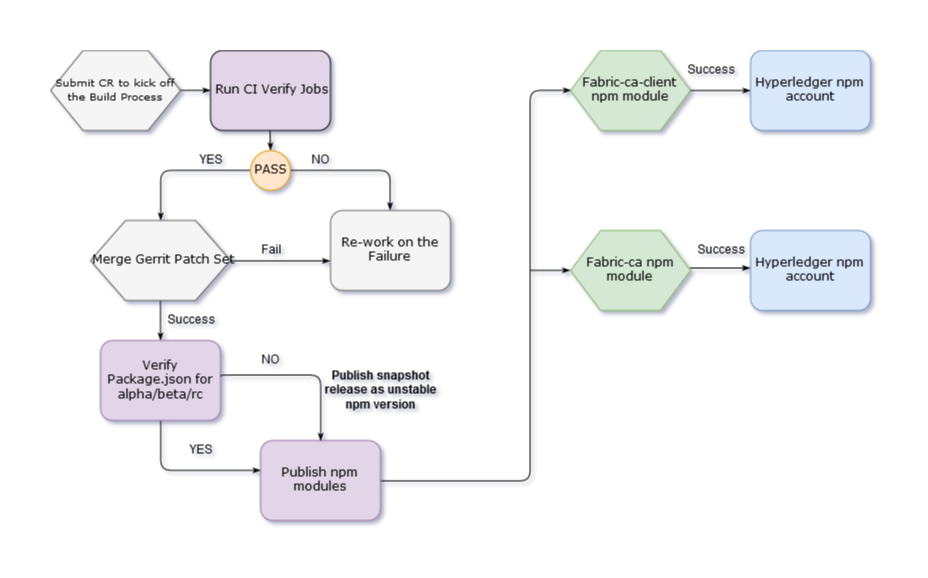
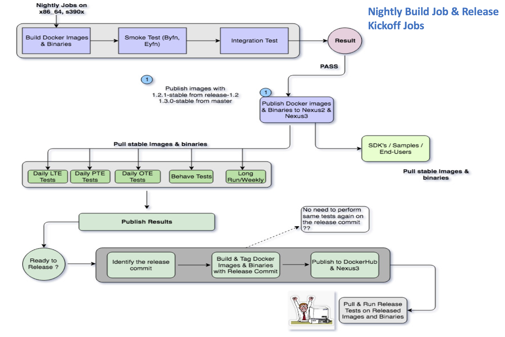

# Release Process Document

Below is the detailed plan on the Hyperledger Fabric Release process, namely the
steps taken to publish docker images, fabric binaries and publish npm modules.

### Step 1: Prerequisite Check

Prior to a new release, a Release Engineer (RE) has to check the prerequisites
of each repository. The pre-checks mentioned below are for the RE’s reference,
and should be checked before the release process begins:

- Ensure that the fabric-baseimage version is set to the correct version in all
of the required files.
- Ensure that each release job is compatible with the upcoming release.
- Ensure that the RE has maintainer access to cut the release tags for each
repository.

_Note: The Release Managers are also responsible for announcing the Merge Freeze
for the upcoming release._

### Step 2: Project Release Order

The release process is executed by running the release process the
following Hyperledger projects (listed in order):

* Fabric-baseimage (typically done well before release day)
* Fabric
* Fabric-ca
* Fabric-chaincode-node
* Fabric-sdk-node
* Fabric-sdk-java (FUTURE)

### Step 3: Post-Release Verification

Once the release process is completed successfully, verify the below
tests as a post-release verification check:

- Verify that the docker images for the fabric and fabric-ca projects are
published successfully.

- Make sure fabric and fabric-ca binaries are published successfully.

- Execute the bootstrap.sh script with current released/published version set
to ensure that the newly published images and binaries are available.

- Verify that the fabric and fabric-ca documentation (RTD) is pointing to the
right release.

- Execute the e2e_byfn, fabric-ca samples, fab car, balance transfer and e2e_cli
tests across all of the supported platforms.

### Step 4: Release Announcement

- Based on a successful post-release verification process, publish the results
to the community.

<!-- TODO: Document the revert process to capture what we do if there's
a problem with the release. -->

## Publishing the Hyperledger Fabric npm modules

As part of the `hyperledger/fabric-sdk-node npm` release process, Jenkins triggers
the following job after updating the **version number** in the **package.json**
file, located in both the fabric-client and fabric-ca-client subdirectories of
the `hyperledger/fabric-sdk-node` repository. This update is made by a
maintainer:

Jenkins triggers the release process on the x86_64 platform and upon a
successful run, the release job publishes the new versions of the npm modules
for fabric-client and fabric-ca-client to Hyperledger npm repositories-
(<https://www.npmjs.com/package/fabric-client>) and
(<https://www.npmjs.com/package/fabric-ca-client>), respectfully.

The `fabric-sdk-node-merge-x86_64` job triggers on every commit merge and looks
for the version number in the package.json file. If the version number contains
**snapshot** in its name, then release process publishes **unstable** npm
modules, much like what's mentioned below:

    - fabric-ca-client@1.0.0-snapshot.xx
    - fabric-client@1.0.0-snapshot.xx

If not, the npm release process publishes npm modules as **stable**, much like
what's mentioned below:

    - fabric-ca-client@1.0.0-alpha2,
    - fabric-client@1.0.0-alpha2

## Nightly Release Process

The Fabric CI team has adopted a Continuous Delivery approach to building,
testing, and releasing Hyperledger Fabric (and associated) projects. We have
provided the community with several Jenkins jobs that are executed on a nightly
basis. Together, the jobs provide the Hyperledger Fabric community with a steady
stream of stable releases based on the latest project commits. The sections that
follow will describe both the daily and nightly build processes, and well as our
downstream Jenkins jobs that are triggered _after_ the daily and nightly build
jobs have successfully completed.

### Jenkins Jobs Dashboard

The nightly Jenkins jobs are observable from the **Daily** tab located
on our [Jenkins dashboard](https://jenkins.hyperledger.org/view/Daily/).

### Nightly Release Jobs

The nightly release jobs are responsible for building stable Fabric images and
binaries from the latest Fabric commits, then publishing these images and
binaries to the Nexus repository. The nightly release jobs build Fabric images
and binaries against the master and release-1.2 branches. The jobs are separated
by architecture (x86_64 and s390x):

-   fabric-nightly-release-job-master-s390x
-   fabric-nightly-release-job-master-x86_64
-   fabric-nightly-release-job-release-1.2-x86_64
-   fabric-nightly-release-job-release-1.2-x86_64

## Nightly Build Release Process

The diagram above illustrates how the nightly build release process works. Next,
we will discuss each step in the process.

### 1. Nightly Build

The nightly build process starts with the upstream jobs, which are responsible
for building the Docker images and binaries from either the _master_ or
_release-1.2_ branches. These jobs trigger the smoke (BYFN, EYFN) and
integration tests to ensure that the images previously built are stable. When
the tests **PASS**, the jobs publish both the Docker images and Fabric binaries
to the Nexus repository.

<!-- TODO: Mention the following when this feature becomes available:

This process allows our Fabric SDK projects and the
fabric-samples project (also, our end-users) to **pull** the latest images and
binaries from the Nexus repositories instead of building these images from
scratch, decreasing the execution times for any of our Jenkins jobs that require
us to utilize the latest commits from each of these branches.

-->

#### Nightly Build Failures

In the event that the nightly build process fails, the Fabric CI team examines
each failure to determine what happened. Once the root cause of the failure(s)
is determined, the Fabric CI team files a bug in JIRA using the `ci_failure`
label, and notifies all interested parties that the nightly job has failed.
You can see a list of the currently OPEN bugs here:

https://jira.hyperledger.org/issues/?filter=12103

### 2. Downstream Jobs

Once the publishing script from the upstream jobs are complete, the upstream
jobs use the `GIT_COMMIT` environment variable to trigger a number of downstream
jobs that pull the (newly published) stable images and binaries from the Nexus
repository, then run a number of Fabric test suites:

- **Daily LTE** - the daily Ledger Traffic Engine tests
- **Daily OTE** - the daily Orderer Traffic Engine tests
- **Daily PTE** - the daily Performance Traffic Engine tests
- **FVT** - the Full Verification Test suite

<!-- TODO: Mention the following when this feature becomes available:

- **Long Run/Weekly** - we have a number of long-running Weekly tests that are
also executed in conjunction with the daily tests.

-->
### 3. Publish results

For each of the tests above, we publish the results from those tests inside of
each job. Each test collects a number of logs and status information to
determine if the tests passed or failed.

### 4. Release Day Readiness

On release day, the Fabric CI team will determine if the latest nightly builds
(and triggered tests) have completed successfully. If so, we
identify which commits are related to the upcoming release, then run the release
jobs which build and tag our Docker images and binaries with the
release commit(s). Finally, we publish the release images and binaries to
the Hyperledger Dockerhub registry and the Nexus repository (nexus3) for public
use.
