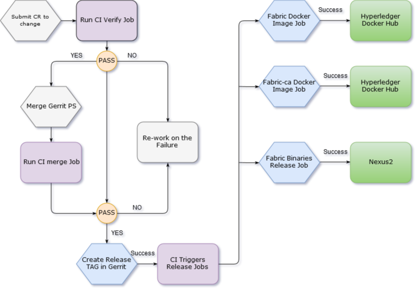

# Release Process Document

Below is the detailed plan on the Hyperledger Fabric Release process, namely the steps taken to
publish docker images, fabric binaries and publish npm modules.

On the release day a maintainer submits a patch set to the hyperledger/fabric repository to trigger
the release process by changing the following variables in the Makefile - ``IS_RELEASE = TRUE``,
``BASE_VERSION`` and ``PREVIOUS_VERSION`` - to the appropriate versions.

CI triggers the fabric-verify-x86_64 and fabric-verify-z jobs and returns **SUCCESS (+1)**
or **FAILURE (-1)** results (gerrit voting) back to the gerrit patch set commit. After approving
the successful patch, maintainers merge the patch which in turn triggers the CI merge jobs.

Upon notification of the successful merge, the Release Engineer creates a "Release Tag" in the
Hyperledger/fabric repository which in turn kicks off the Build Process and CI (Jenkins) triggers
release jobs (listed below) based on the newly created "Release Tag".

The above process also applies to hyperledger/fabric-ca and hyperledger/fabric-baseimage.



**Release Process from CI**:

As part of the release process, CI automatically triggers the following release jobs after a
"Release Tag" is created in each repository:

- **Publish Fabric Docker images**:

CI triggers release jobs on all three platforms (**x86_64, s390x and ppc64le**) and upon a successful
run, publishes Docker images (*peer, orderer, javaenv, ccenv, zookeeper, couchdb, kafka, tools*) to the
[(https://hub.docker.com/u/hyperledger/)](https://hub.docker.com/u/hyperledger/ "Hyperledger Docker Hub") account.

- fabric-app-image-release-docker-s390x
- fabric-app-image-release-docker-x86_64
- fabric-app-image-release-docker-ppc64le

What happens?:

- Release job executes `make docker` and builds docker images. The job then calls a docker push
script to publish the docker images to the Hyperledger Docker Hub account.

- Each image is then tagged as follows:

     ARCH_Name-BASE_VERSION ex: (hyperledger/fabric-peer:s390x-1.0.0-alpha2)

- **Publish fabric binaries**:

CI triggers the below release job on x86_64 platform to publish fabric binaries to nexus release URL -
[(https://nexus.hyperledger.org/content/repositories/releases/org/hyperledger/fabric/fabric-binary/)]
((https://nexus.hyperledger.org/content/repositories/releases/org/hyperledger/fabric/fabric-binary/)
"fabric binary")

    fabric-binaries-release-x86_64

The CI does the following when a release job is triggered:

- Builds fabric binaries (cryptogen & configtxgen) for all platforms
(windows-amd64, linux-amd64, linux-s390x, linux-ppc64le and darwin-amd64) using `make release-all`
- Copies contents of e2e_cli folder and places into release folder
- tar the complete release folder and push the tar.gz folder to nexus releases URL using
maven-deploy-plugin:deploy-file plugin from CI.

- **Publish fabric-ca Docker image**:

As part of the hyperledger/fabric-ca release process, we trigger the following release job after
successfully creating the "Release Tag" in the hyperledger/fabric-ca repository, along with release
notes.

CI triggers release jobs on all three platforms (**x86_64, s390x and ppc64le**) and upon a
successful run, publishes fabric-ca docker image (**ca**) to the
[(https://hub.docker.com/u/hyperledger/)](https://hub.docker.com/u/hyperledger/ "Hyperledger Docker hub")
account.

- fabric-ca-release-x86_64
- fabric-ca-release-s390x
- fabric-ca-release-ppc64le

What happens?:

- Release job executes `make docker` and builds docker images.  The job then calls a docker push
script to publish the docker images to the Hyperledger Docker Hub account.

- Each image is then tagged as follows:

     componentname-Platform ARCH Name-BASE_VERSION ex: (hyperledger/fabric-ca:s390x-1.0.0-alpha2)

If the release jobs are not triggered automatically, the CI team triggers the above release jobs
manually by providing the release version in the ``GERRIT_REFSPEC`` variable. Below is the process
to do that:

- Login to [jenkins.hyperledger.org](http://jenkins.hyperledger.org "Jenkins")
- Go to **fabric-app** view

    - Click on each platform specific release job (fabric-app-image-release-docker-x86_64)
    - Click on **Build with Parameters**
    - Provide ```release tag``` in ```GERRIT_REFSPEC``` ```(+refs/tags/*:refs/remotes/origin/tags/*)```
    - ex: +refs/tags/v1.0.0-alpha2:refs/remotes/origin/tags/v1.0.0-alpha2
    - Click on Build

- **publish npm modules**

As part of the hyperledger/fabric-sdk-node npm release process, CI triggers the following job after
successfully update the **version number** in **package.json** in fabric-client and fabric-ca-client
directories in hyperledger/fabric-sdk-node repository by a maintainer.


CI triggers release process on x86_64 platform and upon successful run, job publishes npm versions
of fabric-client and fabric-ca-client to hyperledger npm repository (https://www.npmjs.com/package/fabric-client)
and (https://www.npmjs.com/package/fabric-ca-client).

`Fabric-sdk-node-merge-x86_64` job triggers on every commit merge and look for the version number
in package.json. If the version number matches **snapshot** then it releases a npm version as
**unstable** like mentioned below

```
fabric-ca-client@1.0.0-snapshot.xx,
fabric-client@1.0.0-snapshot.xx
```
otherwise it publishes npm version as a **stable** version like mentioned below

```
fabric-ca-client@1.0.0-alpha2,
fabric-client@1.0.0-alpha2
```
