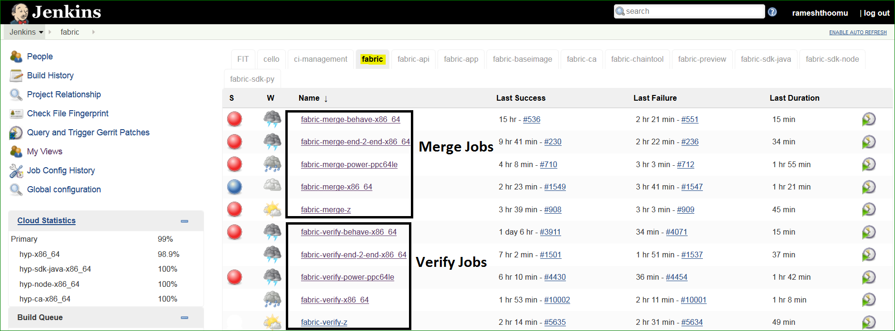
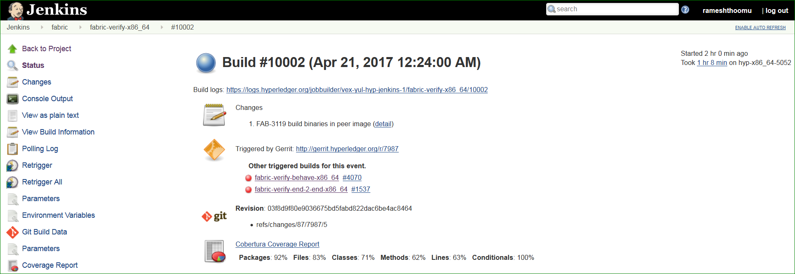

# Hyperledger fabric CI Process:

This repository contains CI Configuration for all repositories including **fabric, fabric-ca,
fabric-sdk-node, fabric-api,  fabric-busybox,  fabric-sdk-py,  fabric-baseimage, cello,
fabric-chaintool, fabric-app and  fabric-sdk-java**.
All the CI configuration is prepared in Jenkins job builders to create Jenkins Jobs.

As part of CI process, we create JJB's (Jenkins Job Builder) in YAML format to configure Jenkins jobs.
JJB has flexible template system, so creating many similarly configured jobs is easy.
More about Jenkins Job Builder is here [JJB](https://docs.openstack.org/infra/jenkins-job-builder/)

To contribute to ci-management repository, please follow below steps:

##Clone this repo:

This repository is having Jenkins configuration for all the hyperledger/fabric projects.
Follow below steps to clone this repository:

###Using SSH:

Get the below command from **ci-management** project in:
[Gerrit Projects](https://gerrit.hyperledger.org/r/#/admin/projects/).
Follow this link to get LFID if you don't have one:
[lf-account](http://hyperledger-fabric.readthedocs.io/en/latest/Gerrit/lf-account/)

`git clone ssh://<LFID>@gerrit.hyperledger.org:29418/ci-management && scp -p -P 29418 \
<LFID>@gerrit.hyperledger.org:hooks/commit-msg ci-management/.git/hooks/`

###Using HTTP:

`git clone http://<LFID>@gerrit.hyperledger.org/r/a/ci-management`

##Jenkins Sandbox Process:

The Linux Foundation Jenkins Sandbox environment allows developers to create jobs to test their
changes before submitting the code to fabric repository. Hyperledger Jenkins Sandbox environment
is configured similar to the production environment, although it cannot vote in Gerrit.
To use Sandbox Jenkins, please follow this link:
[Jenkins Sandbox Process](https://github.com/hyperledger/ci-management/blob/master/Sandbox_Setup.md)

Go through the below process to understand what happens after you submit a patch to
hyperledger/fabric repository:

##Fabric:

When a user submits a patchset to [fabric](https://gerrit.hyperledger.org/r/#/admin/projects/fabric)
repository, Hyperledger Community CI server (Jenkins) triggers **verify** jobs on
**x86_64, s390x and ppc64le** environments and trigger below jobs

[fabric-verify-x86_64](https://jenkins.hyperledger.org/view/fabric/job/fabric-verify-x86_64/)

[fabric-verify-s390x](https://jenkins.hyperledger.org/view/fabric/job/fabric-verify-z/)

[fabric-verify-ppc64le](https://jenkins.hyperledger.org/view/fabric/job/fabric-verify-power-ppc64le/)

[fabric-verify-end-2-end-x86_64](https://jenkins.hyperledger.org/view/fabric/job/fabric-verify-end-2-end-x86_64/)

[fabric-verify-behave-x86_64](https://jenkins.hyperledger.org/view/fabric/job/fabric-verify-behave-x86_64/)

and runs on the available nodes on each platform.

As part of CI process on fabric repository, we run below tests on **x86_64** and run unit-tests on
**s390x** and **ppc64le** platforms.

    code-checks (make linter)

    go unit-tests (make unit-tests) on docker containers

    behave tests (behave -k -D cache-deployment-spec)

    End-to-End Tests (e2e chaincode tests using CLI)

Once the tests are executed successfully, Jenkins publish Voting +1 to commit on the gerrit commit
request as **(+1 Hyperledger Jobbuilder)** otherwise -1 **(-1 Hyperledger Jobbuilder)**.
Upon successful code review is done by the maintainers and merge the commit, Jenkins triggers merge
jobs on *x86_64, s390x and ppc64le* platforms.

[fabric-merge-x86_64](https://jenkins.hyperledger.org/view/fabric/job/fabric-merge-x86_64/)

[fabric-merge-z](https://jenkins.hyperledger.org/view/fabric/job/fabric-merge-z/)

[fabric-merge-power-ppc64le](https://jenkins.hyperledger.org/view/fabric/job/fabric-merge-power-ppc64le/)

[fabric-merge-behave-x86_64](https://jenkins.hyperledger.org/view/fabric/job/fabric-merge-behave-x86_64/)

[fabric-merge-end-2-end-x86_64](https://jenkins.hyperledger.org/view/fabric/job/fabric-merge-end-2-end-x86_64/)

Once the tests are executed successfully, Jenkins publishes and displays the code coverage report on
Jenkins console. Jenkins supports cobertura code coverage report to display the go code coverage.
Also, post build action captures all the artifacts and display on Jenkins console for 30 days. CI also
publish build artifacts to nexus repository.

###*Build Notifications*:

Once the build is executed successfully, user should be able to view build results on Jenkins console
with Green bubble and CI publish voting with +1 or -1 on gerrit patchset.

###*Trigger Builds through commits*:

Re-verification of builds in possible in Jenkins. Developer has to type **reverify** or **recheck**
in gerrit commit. Follow the below process to do this.

Step 1: Open gerrit commit for which you want to reverify or recheck the build

Step 2: Click on **Reply** and type **recheck** or **reverify** and click **Post**

After build is triggered, verify the Jenkins Console Output and go through the log messages if you
are interested in knowing how the build is making progress.

###*Skip the build*:

Skipping the build is possible in Jenkins for readme or WIP patch sets. Very useful feature to skip
the unnecessary builds and save resources. Follow below process to do this.

**Step 1:** Add [ci skip] in the commit description. Please avoid adding [ci skip] in commit message
(First Line) instead add the same in commit description (Body of the commit message).

After commit is pushed to gerrit, now Jenkins triggers the build but it will not built.
Jenkins notify "NOT BUILT" in gray bubble in Jenkins console output.
