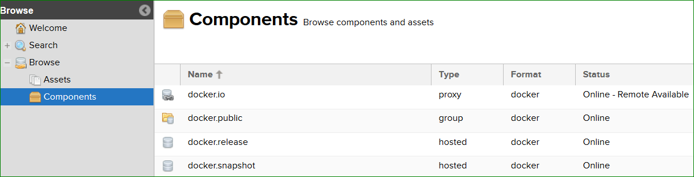
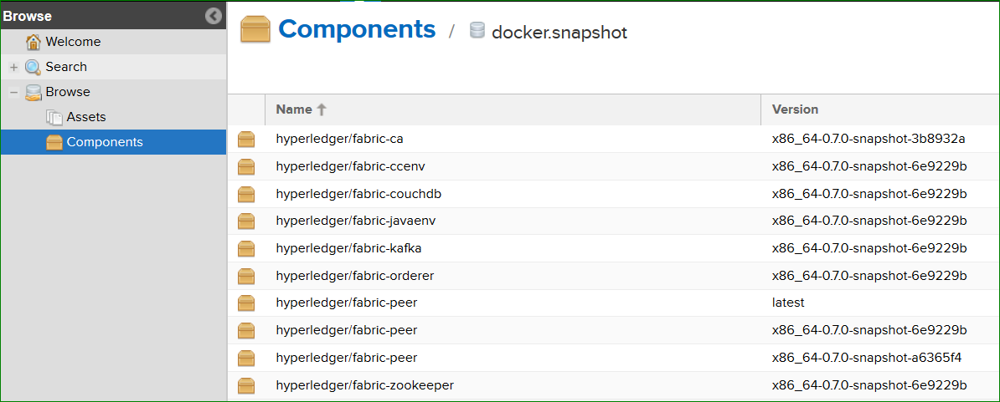

## Publish Docker Images to Nexus Repository

We publish v1.0 docker images to nexus repository for quicker and better usage of docker images
and this also reduces time to build images manually. Once the images are stable, we publish them to
**docker.release** component based on the release plan. Below is the process we follow in CI
and instructions are provided to pull these images.

We have a script to pull all these images, re-tag it to hyperledger images then delete nexus
docker images from machine.

### Process

Jenkins CI publishes below listed docker images to [Daily Snapshots]
(https://nexus3.hyperledger.org/#browse/browse/components:docker.snapshot)
after every successful end-to-end tests of CLI, NODE, JAVA. Example:



Daily snapshots are pushed to nexus3 from port 10003 into docker.snapshot.

nexus-docker CI job executes below steps:

**BUILD & PUSH DOCKER IMAGES:**
----------------------

- Clone **latest** commit from fabric repository
  `git clone ssh://hyperledger-jobbuilder@gerrit.hyperledger.org:29418/fabric`

- Run `make docker` to build v1.0 docker images

- Tag `hyperledger/fabric-$IMAGE_NAME` to nexus as mentioned below

  ```
  docker tag $ORG_NAME-$IMAGE_NAME:latest $NEXUS_URL/$ORG_NAME-$IMAGE_NAME:$FABRIC_SNAPSHOT_TAG
  ```

- Push docker images to nexus as mentioned below

  ```
  docker push $NEXUS_URL/$ORG_NAME-$IMAGE_NAME:$FABRIC_SNAPSHOT_TAG
  ```

After images are published to docker.snapshot component, developers has to pull docker images
from nexus repository. Follow the below steps to download docker images from nexus repository.

You can see image references here



**PULL DOCKER IMAGES:**
----------------------

To pull docker images from nexus repository, follow below steps

- Login as docker user

  - *docker login -u docker -p docker nexus3.hyperledger.org:10001*

  - *docker pull nexus3.hyperledger.org:10001/$ORG_NAME-$IMAGE_NAME:$FABRIC_SNAPSHOT_TAG*

Example:

  `docker pull nexus3.hyperledger.org:10001/hyperledger/fabric-peer:x86_64-0.7.0-snapshot-6e9229b`

Use 10001 for any read/pull requests.
Port 10002 and 10003 are used strictly for pushing images and not pulling.

**Re-Tag Docker Images:**
----------------------

After pull the docker images, follow below steps to re-tag nexus tag to hyperledger

- Re-Tag

  - ```docker tag $NEXUS_URL/$ORG_NAME-$IMAGE_NAME:$FABRIC_SNAPSHOT_TAG hyperledger/fabric-$IMAGE_NAME:$SNAPSHOT_TAG```

  - ```docker tag $NEXUS_URL/$ORG_NAME-$IMAGE_NAME:latest hyperledger/fabric-$IMAGE_NAME:latest```

Example:

  ```
  docker tag nexus3.hyperledger.org:10001/hyperledger/fabric-peer:x86_64-0.7.0-snapshot-6e9229b hyperledger/fabric-peer:latest
  ```

Above process applies to **fabric-ca** docker images as well.
