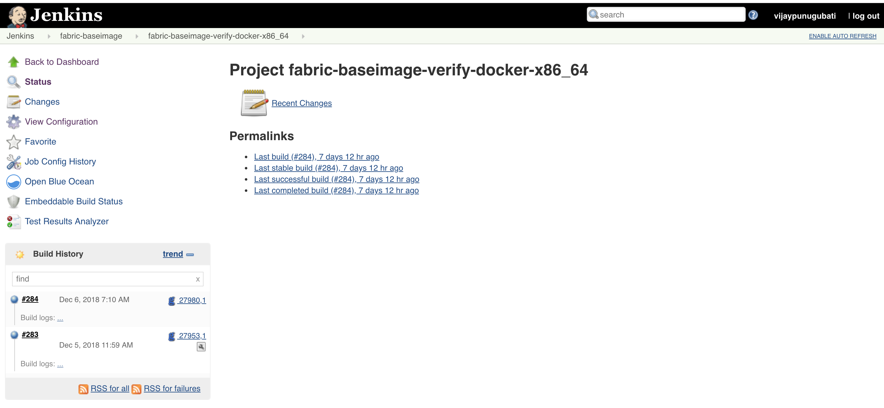
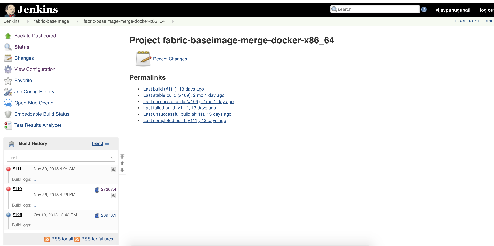

Fabric-baseimage CI process
===========================

This document explain the CI process for the **fabric-baseimage** repository. The
following advances clarifies the execution process when a patch set is submitted to the Fabric
-baseimage repository.

At whatever point a patch set is submitted to the fabric-baseimage repository, Jenkins
triggers the CI build process to test and validate the patch set. The fabric-baseimage
CI **verify and merge** jobs are configured to test patch set in the
jenkins environment.

The Hyperledger Fabric (and associated) projects utilize various tools
and workflows for continuous integration. Fabric-baseimage CI is
currently utilizing the following revisions in the **Master** branch.

**Master:**

-  GO version:(e.g. v1.11.1)
   https://github.com/hyperledger/fabric-baseimage/blob/master/scripts/common/setup.sh

-  NODE version: 8.11.3

If you are interested to know more details about fabric-baseimage CI process, Please click the link
: `fabric-baseimage <https://jenkins.hyperledger.org/view/fabric-baseimage/>`__,

We create JJBs (Jenkins Job Builder files) in YAML format to configure Jenkins jobs. <https://github.com/hyperledger/ci-management/tree/master/jjb/fabric-baseimage/>`__
JJBs have a adaptable templating framework, so making numerous jobs with a common
configuration is direct. You can find more insights regarding Jenkins Job
Builder on `the JJB webpage <https://docs.openstack.org/infra/jenkins-job-builder/>`__.

Build Process
^^^^^^^^^^^^^^
At the point when a patch set is submitted to the `Fabric-baseimage <https://jenkins.hyperledger.org/view/fabric-baseimage/>`__
repository, the Hyperledger Community CI server (Jenkins) triggers **Verify**
jobs on **x86_64 and s390x** platforms using the patch set’s parent commit which may or may
not be the latest commit on **fabric-baseimage**. Let's see what we do in verify jobs.

Verify Jobs
^^^^^^^^^^^^
Jenkins trigger below two jobs on patch set submission.
-  `fabric-baseimage-verify-docker-x86_64 <https://jenkins.hyperledger.org/view/fabric-baseimage/job/fabric-baseimage-verify-docker-x86_64/>`__
-  `fabric-baseimage-verify-docker-s390x <https://jenkins.hyperledger.org/view/fabric-baseimage/job/fabric-baseimage-verify-docker-s390x/>`__

What does verify job do:
^^^^^^^^^^^^^^^^^^^^^^^^
The verify job builds the baseimages (baseimage, basejvm, baseos) and furthermore builds the third-party images
(Kafka, Zookeeper, CouchDB) in the CI job by executing the following make targets.

``make docker`` -- Builds the baseimages
``make dependent-images`` -- Builds the third-party images

After the patchset is verified successfully, jenkins sends +1 vote back to gerrit patchset if not sends -1 on the patchset.
Please refer the below section to re-trigger/re-verify the specific failed job.



   Views

After the patch is successfully verified by the Jenkins, the maintainer gives +2 and click on submit button to merge the patchset.
This trigger's the merge jobs.

Merge Jobs:
^^^^^^^^^^^
Jenkins trigger's the below merge jobs.

-  `fabric-baseimage-merge-docker-x86_64 <https://jenkins.hyperledger.org/view/fabric-baseimage/job/fabric-baseimage-merge-docker-x86_64/>`__
-  `fabric-baseimage-merge-docker-s390x <https://jenkins.hyperledger.org/view/fabric-baseimage/job/fabric-baseimage-merge-docker-s390x/>`__



   Views

What does merge job do:
^^^^^^^^^^^^^^^^^^^^^^^
The merge job builds the baseimages (baseimage, basejvm, baseos) and third-party images (Kafka, Zookeeper, CouchDB) by using make targets.
the merge jobs also verifies the unit-tests and  byfn tests by building the fabric and fabric-ca docker images based on the baseimages and third-party images which are created in the previous step. This is to ensure the latest baseimage code will work as expected on the baseimage dependent repositories.

The script executes the below commands:

- ``make docker````make dependent-images`` and tag the images with the fabric-baseimage BASE_VERSION. Ex. docker tag hyperledger/fabric-baseimage hyperledger/fabric-baseimage:$ARCH-$BASE_VERSION.
- Clone the fabric and fabric-ca repositories and update the BASEIMAGE_RELEASE version to the tagged baseimage version.
- After update the BASEIMAGE_RELEASE, the script executes the below commands.
     ``basic-checks`` -- Checks license linter spelling
     ``docker`` -- Builds the fabric images
     ``release-clean`` -- Clean the binaries from the host platform
     ``release`` -- builds release packages for the host platform
     ``unit-tests`` -- run the unit-tests

- Clone the fabric-samples repository and then checks out to the master branch. Execute ``byfn and eyfn`` tests with (default, custom channel, couchdb and nodejs chaincode).

See the CI script here:<https://github.com/hyperledger/ci-management/blob/master/jjb/fabric-samples/shell/include-raw-fabric-samples-byfn-e2e.sh>`__
Jenkins sends build result back to patchset.Though the build result will not update the existing patchset vote value but you can see the build result on the patchset history.

Build Notifications:
^^^^^^^^^^^^^^^^^^^^
Jenkins sends the build failure email notifications to the CI team.

Triggering failed jobs through Gerrit comments:
^^^^^^^^^^^^^^^^^^^^^^^^^^^^^^^^^^^^^^^^^^^^^^^
Re-triggering builds is possible with the existing Jenkins configuration by posting a comment on
the Gerrit patch set, which will re-trigger a explicit job.
Follow the below steps:

Step 1: Open the Gerrit patch set for which you want to reverify the build

Step 2: Click on **Reply**, then type one of the below comments and
click on **Post** button.

   ``reverify``   - Triggers fabric-baseimage-verify-docker-x86_64 & fabric-baseimage-verify-docker-s390x CI job,
   ``reverify-x`` - Triggers fabric-baseimage-verify-docker-x86_64 only,
   ``reverify-z`` - Triggers fabric-baseimage-verify-docker-s390x only,
   ``remerge``    - Triggers fabric-baseimage-merge-docker-x86_64 & fabric-baseimage-merge-docker-s390x CI job

Note: Developers have to check the result of the failed job before they re-trigger the job.

Build on Commit Message changes:
^^^^^^^^^^^^^^^^^^^^^^^^^^^^^^^^
With the existing Jenkins job configuration, Jenkins will not trigger jobs on commit message changes.e

Questions:
^^^^^^^^^^
If you see any build failures please create bug/task in hyperledger fabric-baseimage JIRA project. Also please reach out to CI team in https://chat.hyperledger.org/channel/ci-pipeline or
https://chat.hyperledger.org/channel/fabric-ci RC channels for any clarifications..
