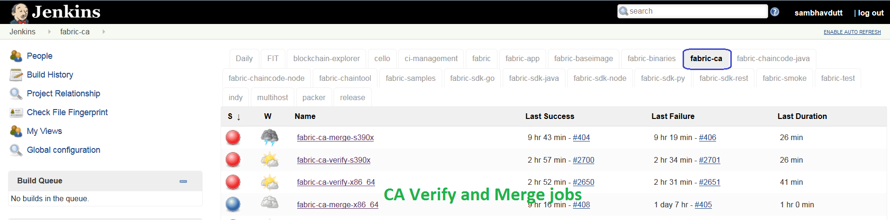
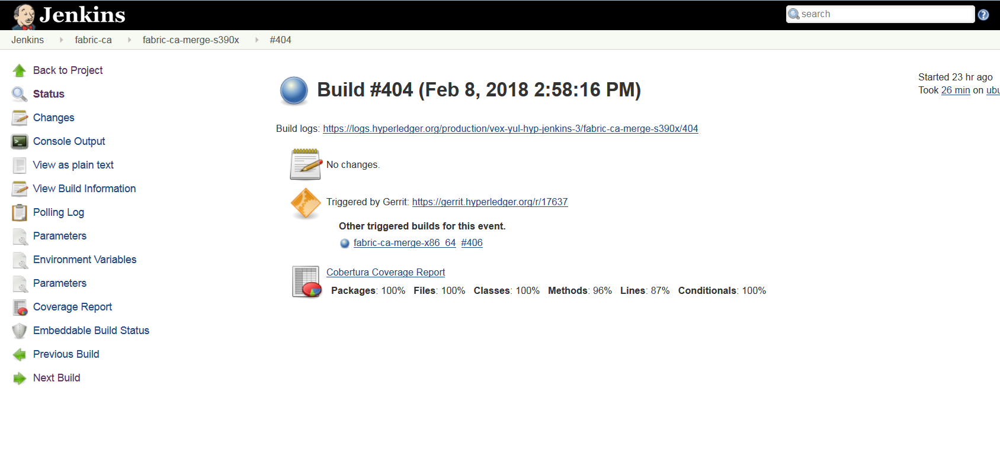

Fabric-CA
=========

This document explains the Fabric-ca CI process. The below steps
explains what CI follows or executes when a patchset is submited to the
fabric-ca repository.

Whenever a patchset is submitted to the fabric-ca repository, Jenkins
triggers the CI build process to test and validate the patchset.
The fabric-ca CI **verify and merge** jobs are configured to test the
patchset in the below environment.

The Hyperledger Fabric (and associated) projects utilize various tools
and workflows for continuous project development. The fabric-ca project is
currently utilizing the following versions in the **Master** ,
**Release-1.0** and **Release-1.1** branches.

**Master:**

-  GO version: v1.9.2
   https://github.com/hyperledger/fabric-ca/blob/master/ci.properties

-  DOCKER version: 17.12.0-ce

-  baseimage version(e.g. 0.4.6):
   https://github.com/hyperledger/fabric-ca/blob/be7180447ce9b47a4d3ae33210b5cf00d67ff6d9/Makefile#L55

**Release1.0:**

-  GO version: v1.7.5
   https://github.com/hyperledger/fabric-ca/blob/release-1.0/ci.properties

-  DOCKER version: 17.12.0-ce

-  baseimage version(e.g. 0.3.1):
   https://github.com/hyperledger/fabric-ca/blob/d5aa9afd6044201acd225494ee8c7537cd5a6673/Makefile#L47

**Release1.1:**

-  GO version: v1.9.2
   https://github.com/hyperledger/fabric-ca/blob/release-1.1/ci.properties

-  DOCKER version: 17.12.0-ce

-  baseimage version(e.g. 0.4.6):
   https://github.com/hyperledger/fabric-ca/blob/d536f5a4b9dbfe057af16dd5ae2ab87841b80f9c/Makefile#L62

If you would like to know more details on the tool versions, you can
refer from any `fabric-ca <https://jenkins.hyperledger.org/view/fabric-ca/>`__ jobs listed here:
`fabric-ca <https://jenkins.hyperledger.org/view/fabric-ca/>`__

Select one of the jobs, click on any build number in the bottom left and view
the output for details.

Build Process
~~~~~~~~~~~~~

There are several Jenkins job types that are common across Hyperledger
Fabric projects. In some cases, you may not see all of the common
job types implemented for every project. This depends on the specific needs of
each Hyperledger Fabric project. The CI configurations are managed with Jenkins
Job Builder to create, update and modify all of the Jenkins Jobs.

As part of the CI process, we create JJB (Jenkins Job Builder) files in YAML
format to define Jenkins jobs. JJB has a flexible templating system, which makes
creating multiple jobs with a common configuration easy. More
details about Jenkins Job Builder are available in `the JJB
webpage <https://docs.openstack.org/infra/jenkins-job-builder/>`__.

The following steps explain the process that is executed when we submit a patch
to the **fabric-ca** repository.

When a patchset is submitted to the
`fabric-ca <https://jenkins.hyperledger.org/view/fabric-ca/>`__
repository, the Hyperledger Community CI server (Jenkins) triggers
**Verify** jobs on **x86_64** and **s390x** platforms using the
patchset’s parent commit which may or may not be the latest commit on
**fabric-ca**. The following verify jobs are triggered.

-  `fabric-ca-verify-x86_64 <https://jenkins.hyperledger.org/view/fabric-ca/job/fabric-ca-verify-x86_64/>`__

-  `fabric-ca-verify-s390x <https://jenkins.hyperledger.org/view/fabric-ca/job/fabric-ca-verify-s390x/>`__

-  `fabric-ca-verify-end-2-end-x86_64 <https://jenkins.hyperledger.org/view/fabric-ca/job/fabric-ca-verify-end-2-end-x86_64/>`__

   Views

Below are the steps that the CI server executes on **Verify** and **Merge**
jobs:

**fabric-ca-verify-end-2-end-x86_64**

Step1: Clones the Fabric repository:

-  Clones the latest commit from the Gerrit Fabric repository and then
   checkout to the branch. If the patchset is triggered on Fabric
   release-1.0 branch, script will checkout to release-1.0 branch.
-  After the Fabric and Fabric-ca repositories afre cloned in the above
   step, CI script executes to build Docker images to kick off the e2e
   tests.

Step 2: Executes the e2e tests:

Below are the tests triggers in Fabric-ca e2e job:

1. e2e-node - Runs the sdk-node e2e tests (Executes **gulp test**
   command).

   -  Clones fabric-sdk-node repository and will checkout to Branch
   -  Spins up network using the docker-compose file from
      test/fixtures folder
   -  Install nodejs 8.9.4 version
   -  run
      ``istanbul cover --report cobertura test/integration/e2e.js``

2. e2e-java - Runs e2e java integration tests.

   -  If the patchset is on release-1.0 branch, we ignore java e2e
      tests for now.
   -  If not, run the java e2e tests by executing ``source cirun.sh``

**fabric-ca-verify-x86_64** & **fabric-ca-verify-s390x**

Step1: Clones the Fabric repository:

-  Clones the latest commit from the Gerrit fabric-ca and then checkout
   to the branch. If the patchset is triggered on fabric-ca release-1.0
   branch, script will checkout to the release-1.0 branch.

Step2: Executes fabric-ca tests using below two commands:

   ``make ci-tests``

   ``make docker-fvt``

Once the tests are completed, Jenkins posts +1 vote to the patchset **+1
–> Hyperledger Jobbuilder** upon successful completion and -1 **-1 –>
Hyperledger Jobbuilder** in case of failure.

Once the patchset is approved by CI and the maintainers, they will merge
the patchset which triggers below **Merge** jobs and runs the above
mentioned tests on the latest fabric-ca commit (doesn’t use the
patchset’s parent commit).

-  `fabric-ca-merge-x86_64 <https://jenkins.hyperledger.org/view/fabric-ca/job/fabric-ca-merge-x86_64/>`__

-  `fabric-ca-merge-s390x <https://jenkins.hyperledger.org/view/fabric-ca/job/fabric-ca-merge-s390x/>`__

-  `fabric-ca-merge-end-2-end-x86_64 <https://jenkins.hyperledger.org/view/fabric-ca/job/fabric-ca-merge-end-2-end-x86_64/>`__

After the tests are executed, It is time to archive the logs (artifacts)
and publish the code coverage. CI publishes the logs(artifacts) and the
Code Coverage report(Cobertura Coverage Report)on Jenkins console.

   ConsoleOutPut

Build Notifications
~~~~~~~~~~~~~~~~~~~

The build results can be viewed on the Jenkins console, where depending
on the result it displays with a colored bubble (blue for success, red for
failure, yellow for unstable and gray for aborted or not executed yet) and a
vote from the CI (+1 or -1) on the Gerrit commit/change.

Also, it sends out an email notification to all the Fabric-ca
maintainers in case of merge job failure.

Trigger failed jobs through Gerrit comments
~~~~~~~~~~~~~~~~~~~~~~~~~~~~~~~~~~~~~~~~~~~

Re-trigger of builds is possible in Jenkins by entering **reverify** in
a comment to the Gerrit change that retriggers all the verify jobs. To
do so, follow the below process:

Step 1: Open the Gerrit patchset for which you want to reverify the
build

Step 2: Click on **Reply**, then type ``reverify`` and click **Post**

This kicks off all the Fabric-ca verify jobs. Once the build is
triggered, verify the Jenkins console output and go through the log
messages if you are interested to know how the build is making progress.

In some cases, Jenkins may fail only in one or two CI jobs due to which
network issues. In such cases, restarting all the fabric-ca jobs through
``reverify`` comment is not necessary. Instead, the developer can post
below comment to trigger the particular failed build:

  ``reverify-e2e`` - re-triggers fabric-ca-merge-end-2-end-x86_64 CI job.

  ``reverify-x``   - re-triggers fabric-ca-verify-x86_64 on x86_64 platform.

  ``reverify-z``   - re-triggers fabric-ca-verify-s390x on s390x platform.

Questions
~~~~~~~~~

Please reach out to us in https://chat.hyperledger.org/channel/ci-pipeline or
https://chat.hyperledger.org/channel/fabric-ci RC channels for
Questions or concerns related to fabric-ca CI process.
