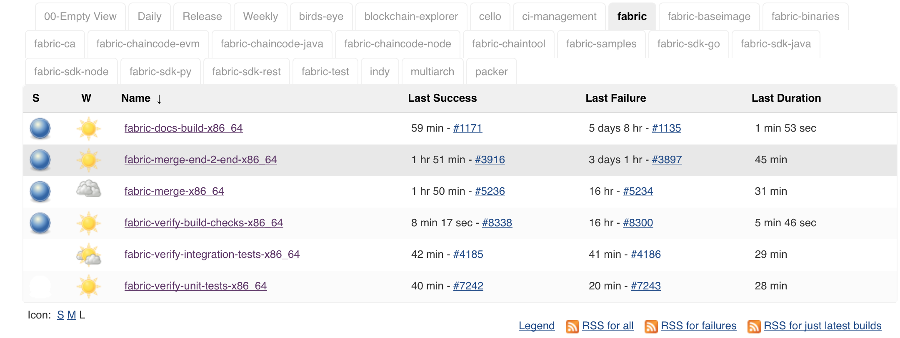
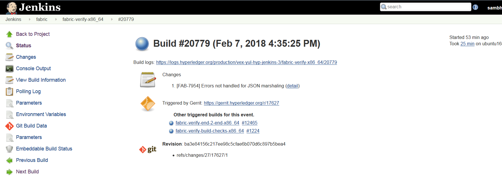

Fabric
======

This document explains the CI process for the **Fabric** repository. The below
steps explain the execution process when a patch set is submitted to the Fabric
repository.

Whenever a patch set is submitted to the Fabric repository, Jenkins
triggers the CI build process to test and validate the patch set. The Fabric
CI **verify and merge** jobs are configured to test patch sets in the
below environment(s).

The Hyperledger Fabric (and associated) projects utilize various tools
and workflows for continuous integration. Fabric CI is
currently utilizing the following revisions in the **Master** and
**Release-1.1**, **Release-1.0** branches.

**Master:**

-  GO version:(e.g. v1.10)
   https://github.com/hyperledger/fabric/blob/master/ci.properties

-  DOCKER version: 17.12.0-ce

-  baseimage version:(e.g. 0.4.6)
   https://github.com/hyperledger/fabric/blob/196c0de7c1618952a8f342e406a1021203845eba/Makefile#L46

**Release-1.0:**

-  GO version:(e.g. v1.7.5)
   https://github.com/hyperledger/fabric/blob/release-1.0/ci.properties

-  DOCKER version: 17.12.0-ce

-  baseimage version:(e.g. 0.4.6)

**Release-1.1:**

-  GO version:(e.g. v1.9.2)
   https://github.com/hyperledger/fabric/blob/release-1.1/ci.properties

-  DOCKER version: 17.12.0-ce

-  baseimage version:(e.g. 0.4.6)
   https://github.com/hyperledger/fabric/blob/da14b6bae4a843dfb3fcece5a08ae0ea18488a7a/Makefile#L39

If you would like to know more details on the tool versions, you can refer to
any of the Fabric jobs listed here: `Fabric <https://jenkins.hyperledger.org/view/fabric/>`__,
select one of the jobs, Click on any build number in the bottom left and view
the output for details.

There are several job types that are common across all Hyperledger Fabric
projects. In some cases, all of the common job types are not in every project.
This depends on the specific needs of the Hyperledger Fabric project being
developed. The CI configuration is prepared using Jenkins Job Builder to create,
update and modify each of the Jenkins Jobs.

As part of managing jobs ran by our Jenkins servers, we create JJBs (Jenkins
Job Builder files) in YAML format to configure Jenkins jobs. JJBs have a
flexible templating system, so creating multiple jobs with a common
configuration is straightforward. You can find more details about Jenkins Job
Builder on `the JJB webpage <https://docs.openstack.org/infra/jenkins-job-builder/>`__.

The following steps explain what happens when a developer submits a patch set to
the **Fabric** repository.

When a patch set is submitted to the `Fabric <https://jenkins.hyperledger.org/view/fabric/>`__
repository, the Hyperledger Community CI server (Jenkins) triggers **Verify**
jobs on **x86_64** platform using the patch set’s parent commit which may or may
not be the latest commit on **Fabric**.

Build Process
^^^^^^^^^^^^^^

The Fabric **verify** build process is split up into multiple jobs. The initial
job (fabric-verify-build-checks-x86_64) is to build and publish docker images
and binaries to Nexus3 and Nexus2, respectfully. These images are later
pulled/downloaded in the downstream jobs, when the triggered conditions are met
in ``fabric-verify-build-checks-x86_64`` CI job.

The list below describes the events that trigger relevant jobs based on the
patch set:

-  ``fabric-verify-build-checks-x86_64`` job is triggered when a
   ``patch set`` is created and it validates the patch sets git commit message.

-  If the commit message in the patch set contains 'WIP', the above build job
   **ignores** the build process and will not post a vote back to Gerrit.
   This means that this job is essentially skipping the build process.
   As a result, you will see “WIP - No build” in the patch set’s comment
   history.

-  If the patch set is not marked as 'WIP' in the commit
   message, and if it is a **documentation change** (which is defined as a
   patch set with changes solely on these file
   extensions (.rst, .md, .py, .png,.css,.html and .ini), the above
   job posts the ``Run DocBuild`` comment to the patch set in Gerrit and
   sends the following votes against the patch set:
   ``F1-VerifyBuild=+1 F2-SmokeTest=+1 F3-IntegrationTest=+1 F3-UnitTest=+1``

     * Run DocBuild
         - This comment triggers `fabric-docs-build-x86_64` CI job. Once
           the doc build is successfully executed, Jenkins sends Gerrit
           a vote of `F2-DocsBuild=+1` on a successful build of the docs,
           or in the event of a failed doc build, a vote of
           `F2-DocsBuild=-1` is sent.

-  If the patch set is not marked as 'WIP' in the commit message, and there
   are **code and documentation changes**,
   fabric-verify-build-checks-x86_64 executes the flow described below. This
   flow also applies to the **code only** patch set excluding documentation
   build process.

        * Executes `make basic-checks`, `make docker` (builds, re-tags and
          publish images to nexus3), `make dist` (builds binaries and
          publishes to nexus2). If any of these make targets fail, the
          fabric-verify-build-checks-x86_64 job sends a `F1-VerifyBuild=-1`
          vote to Gerrit on the patch set, otherwise it sends
          `F1-VerifyBuild=+1`, then triggers **DocsBuild** and
          **SmokeTest** jobs in parallel by posting comments to the patch
          set:

        * Run DocsBuild
            - This comment triggers `fabric-docs-build-x86_64` job and posts
              a vote of `F2-DocsBuild=+1` to Gerrit if successful, or
              `F2-DocsBuild=-1` in the event of a failure. You can review the
              RTD output from the doc build on the nexus log server.

               What happens with **fabric-docs-build-x86_64** job

                Step 1: Builds the documentation changes:
                   - Extracts the documentation files(.md, .rst, .txt, .py,
                     .png, .css, .html & .ini) from the patch set submitted
                     and builds the documentation after verification checks
                     like syntax, and tox verification.This job is triggered
                     only when a patch set contains documentation files.

                Step 2: Documented output is published to Nexus:
                   - Once the documentation build is successful, it is
                     archived, and published on the Nexus repository.

           * Run SmokeTest
               - This comment triggers `fabric-smoke-tests-x86_64` job and posts
                 `F2-SmokeTest=+1` to the patch set and triggers the Unit-Test
                 and IntegrationTest jobs by posting `Run UnitTest` and `Run
                 IntegrationTest` comment if successful, otherwise posts
                 `F2-SmokeTest=-1` which doesn't trigger the Unit-Test or
                 IntegrationTest jobs upon failure.

          * Run IntegrationTest
               - This comment triggers `fabric-verify-integration-tests-x86_64`
                 job and posts `F3-IntegrationTest=+1` on a successful run of
                 the integration tests and a `F3-IntegrationTest=-1` in the
                 event of a failure.

           * Run UnitTest
               - This comment triggers `fabric-verify-unit-tests-x86_64` job and
                 posts `F3-UnitTest=+1` vote against the patch set if
                 successful, otherwise a vote of `F3-UnitTest=-1` is submitted.

Conditions to merge the patch set
^^^^^^^^^^^^^^^^^^^^^^^^^^^^^^^^^^

Maintainers have to look for +1 votes on all the labels before they merge the
patch sets. The votes on the patch set will look like the following:

.. code:: shell

    F1-VerifyBuild     +1 Hyperledger Jobbuilder
    F2-DocBuild        +1 Hyperledger Jobbuilder
    F2-SmokeTest       +1 Hyperledger Jobbuilder
    F3-IntegrationTest +1 Hyperledger Jobbuilder
    F3-UnitTest        +1 Hyperledger Jobbuilder

patch set is not eligible to merge, if it even gets one -1.

   Views

Merge process for Fabric
^^^^^^^^^^^^^^^^^^^^^^^^

Once the patch set is approved by CI and the maintainers, they will merge the
patch set which triggers the **Merge** jobs mentioned below on the latest Fabric
commit (note: this process does not use the patch set’s parent commit).

**fabric-merge-end-2-end-x86_64:**
https://jenkins.hyperledger.org/view/fabric/job/fabric-merge-end-2-end-x86_64/

Step 1: Clones the fabric-ca repository:

-  Clones the latest commit from the Fabric fabric-ca repository and
   then checks out the branch associated with the patch set. If the patch set is
   triggered on the fabric-ca release-1.1 branch, the script will checkout to
   the release-1.1 branch.

-  After the fabric-ca repository is cloned in the above step, the CI script
   proceeds to build the docker images that will be used to run the end-to-end
   (e2e) tests.

Step 2: Executes the e2e tests:

Below are the tests triggers in Fabric e2e job:

1. e2e-cli - Runs fabric/examples/e2e_cli tests.

   -  Executes the network_setup.sh that spins up the network with
      docker-compose file from fabric/examples/e2e_cli folder.

2. e2e-node - Runs the sdk-node e2e tests (Executes **gulp test**
   command).

   -  Clones fabric-sdk-node repository and will checkout to Branch
   -  Spins up network using the docker-compose file from
      test/fixtures folder
   -  Install nodejs 8.9.4 version
   -  RUN
      ``istanbul cover --report cobertura test/integration/e2e.js``

3. e2e-java - Runs e2e java integration tests.

   -  If the patch set is on release-1.0 branch, CI skips the java e2e
      tests for now. TODO# mention the JIRA FAB here.
   -  If not, run the java e2e tests by executing ``source cirun.sh``

4. byfn and efyn - Runs byfn and eyfn tests with default, custom channel,
   couchdb and nodejs chaincode and fabric-ca sample tests. See the CI script
   here: https://github.com/hyperledger/ci-management/blob/master/jjb/fabric-samples/shell/include-raw-fabric-samples-byfn-e2e.sh

**fabric-merge-x86_64:**
https://jenkins.hyperledger.org/view/fabric/job/fabric-merge-x86_64

Step 1: Pulls the third party docker images:

-  Pulls the fabric baseimage version third party docker images (kafka,
   zookeeper, couchdb). The image name is appended with ‘hyperledger’ and tagged
   with the latest tag.

Step 2: Executes Fabric tests using below two commands:

    ``make linter`` See the make linter target in fabric/Makefile
      ( https://github.com/hyperledger/fabric/blob/master/Makefile#L206 )
    ``make unit-test`` See the make unit-test target in fabric/Makefile
      ( https://github.com/hyperledger/fabric/blob/master/Makefile#L184 )

After the verify or merge tests are executed, It is time to archive the
logs (artifacts). CI publishes the logs(artifacts) on Jenkins console.

   ConsoleOutPut

Build Notifications
^^^^^^^^^^^^^^^^^^^^

The build results can be viewed on the Jenkins console, and depending on the
results, it displays a status with a colored bubble (green for success, red for
failure). See the build results on Jenkins console
(Jenkins Console)[https://jenkins.hyperledger.org/view/fabric/]

Trigger failed jobs through Gerrit comments
^^^^^^^^^^^^^^^^^^^^^^^^^^^^^^^^^^^^^^^^^^^

Re-triggering builds is possible with Jenkins by entering a specific comment on
the Gerrit patch set, which can re-trigger a specific verify job. To do so,
follow the process below:

Step 1: Open the Gerrit patch set for which you want to reverify the build

Step 2: Click on **Reply**, then type one of the below comments and
click **Post**

   ``VerifyBuild``   – Triggers fabric-verify-build-checks-x86_64 CI job,
   developers have to check the result of this job before posting the below
   comments on the patch set. As mentioned above, this job publishes images and
   binaries to nexus which further downloaded by SmokeTest and UnitTest jobs.
   Please make sure that the images and binaries are published for that specific
   commit.

   ``Run SmokeTest`` – Triggers fabric-smoke-tests-x86_64.

   ``Run UnitTest``  –  Triggers fabric-verify-unit-tests-x86_64.

   ``Run DocsBuild`` – Triggers fabric-docs-build-x86_64

   ``Run IntegrationTest`` - Triggers fabric-verify-integration-tests-x86_64.

These comments trigger specific Fabric verify jobs. Once the build is triggered,
you can verify the Jenkins console output and go through the log messages if you
are interested to know how the build is actively making progress.

Rebasing Patch Sets
^^^^^^^^^^^^^^^^^^^

When rebasing a patch set, it is important to know that the jobs will only be
re-triggered if there is a change to the files submitted in the original patch
set. This means that if a rebase updates files that were not a part of the
submitted patch set, the VerifyBuild (and downstream) jobs will not be triggered.
When this is the case, and you would like to re-run the tests against your
newly rebased patch set, add the ``VerifyBuild`` comment to the patch set, which
manually triggers the verification/test process.

Amending Commit Messages
^^^^^^^^^^^^^^^^^^^^^^^^
Similar to rebasing, the amendment of a commit message will not re-trigger the
build jobs since there are no changes to the code previously submitted.

Questions
^^^^^^^^^

Please reach out to us in https://chat.hyperledger.org/channel/ci-pipeline or
https://chat.hyperledger.org/channel/fabric-ci RC channels for any questions.
