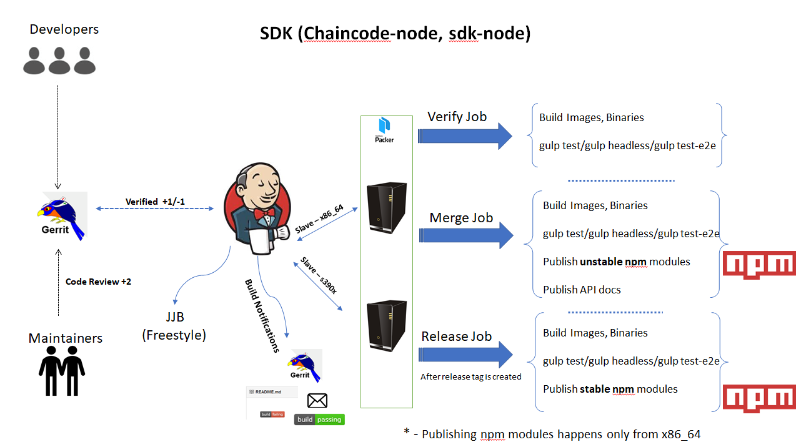
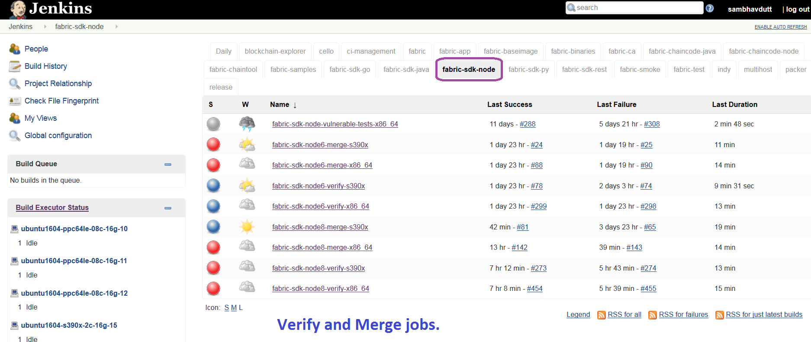
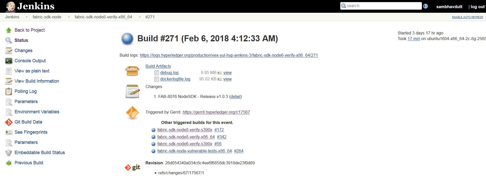

Fabric-SDK-Node
===============

This document explains the fabric-sdk-node CI process. The below
steps explain what CI follows or executes when a patch set is submitted to
the fabric-sdk-node repository.

Whenever a patch set is submitted to the fabric-sdk-node repository,
Jenkins triggers the CI build process to test and validate the patch set.
Fabric-sdk-node CI **verify and merge** jobs are configured to test the
patch set in the below environment.

The Hyperledger Fabric (and associated) projects utilize various tools
and workflows for continuous project development. The fabric-sdk-node is
currently utilizing the following versions in the **Master** and
**Release-1.0** and **Release-1.1** branches.

**Master:**

-  go version: v1.10

-  docker version: 17.12.0-ce

-  npm version: 8.9.4

**Release-1.0:**

-  go version: v1.9

-  docker version: 17.12.0-ce

-  npm version: 6.9.5

**Release-1.1:**

-  go version: v1.9.2

-  docker version: 17.12.0-ce

-  npm version: 8.9.4

If you would like to know more details on the tool versions, you can
refer from any fabric-sdk-node jobs listed here
`fabric-sdk-node <https://jenkins.hyperledger.org/view/fabric-sdk-node/>`__.
Select one of the jobs, Click on any build number in the bottom left and
view the output for details.

Build Process
~~~~~~~~~~~~~

There are several Jenkins job types that are common across Hyperledger
Fabric projects. In some cases, you may or may not see all of the common
job types in every project. This depends on the specific needs of that
Hyperledger Fabric project. The CI configuration is prepared in Jenkins
Job Builder to create, update and modify the Jenkins Jobs.

As part of the CI process, we create JJB’s (Jenkins Job Builder) in YAML
format to configure Jenkins jobs. JJB has a flexible template system, so
creating many similar jobs with a common configuration is easy. More
about Jenkins Job Builder is available on `the JJB
webpage <https://docs.openstack.org/infra/jenkins-job-builder/>`__.

The following explains what happens when we submit a patch to the
**fabric-sdk-node** repository.

When a patch set is submitted to
`fabric-sdk-node <https://gerrit.hyperledger.org/r/fabric-sdk-node>`__
repository, the Hyperledger Community CI server (Jenkins) triggers
**Verify** and jobs on **x86_64** ans **s390x** platforms using the
patch set’s parent commit which may or may not be the latest commit on
**fabric-sdk-node**.

   Views

The following verify jobs and merge jobs are triggered for sdk-node respectively for the {arch}:

fabric-sdk-node-verify-x86_64
fabric-sdk-node-verify-s390x
fabric-sdk-node-merge-x86_64
fabric-sdk-node-merge-s390x

The above jobs are triggered for the x86_64, and this is same for s390x too,

As part of the CI process on **fabric-sdk-node** repository, the
following tests are executed on **x86_64**\ (x) and **s390x**\ (z)
platforms, see the arch value at the end of the job name to know on
which platform we run this job.

   Views

Below is the process we execute in CI on fabric-sdk-node verify and
merge jobs:
Step 1: - Clone fabric & fabric-ca repositories:

-  Clone the latest commit from the Gerrit fabric repository then check out to the branch
   associated with the patch set if the patch is triggered on.

-  Build Docker Images:

   -  fabric-sdk-node only uses the fabric-peer and fabric-orderer images, we
      build only peer-docker and order-docker docker images using
      ``make peer-docker`` & ``make orderer-docker`` to reduce the build
      time.

The same proceess applies to fabric-ca repository too.

Step 2: - Once the images are ready, CI script execute docker-compose
file to spinup the network from /test/fixtures directory.
``docker-compose up >> dockerlogfile.log``

Step 3: - After the network is up, install the nodejs version based on
the Job we are running. If the job name says
``fabric-sdk-node-verify-x86_64``, script installs nodejs version
``8.9.4`` in x86_64 build machine

Step 4: - After the nodejs version installed, CI script executes
``npm install`` , ``gulp`` & ``gulp ca`` commands to download all the
dependent packages.

Step 5: - Once the environment is ready, CI script executes
``gulp test`` command which executes [‘clean-up’, ‘lint’, ‘pre-test’,
‘docker-ready’, ‘ca’] build tasks.

Above process is applicable to both \*\* verify \*\* and \*\* merge \*\*
jobs.

After the builds are executed successfully, it sends a vote to the Gerrit patch set
with a +1, or -1 if the build fails.

Next, on a successful code review(+1) and merge by the maintainers,
Jenkins triggers the **merge** jobs. The merge jobs for
**fabric-sdk-node** perform all steps detailed above and also publish
node modules to NPM Open Source Registry.

-  An initial validation is made to check the version of the npm modules
   created. The version of the created npm modules is compared with the
   version specified in **package.json** file. The package.json file
   holds the current npm details that include the version number too.

-  When the npm version matches with the current specified version in
   **package.json** file, this fabric client/fabric-ca client npm
   version is not published in merge jobs.

-  If the npm module version does not match the current version in the
   package.json and it has a ‘snapshot’ in it’s version tag, it is
   published as the next unstable version of npm.

   If the npm module matches the current existing npm version in the
   package.json file and it has a ``snapshot`` in it’s version tag, it
   is incremented and published as the next unstable version for the
   existing npm version. For example, if the existing unstable npm
   version with the ``snapshot`` tag ends with number 84, the next
   unstable version is incremented by +1 and is stored with the
   ``snapshot`` tag ending with 85. The following are two unstable npm
   versions.

   ::

       fabric-client@1.1.0-snapshot.85
       fabric-client@1.1.0-snapshot.84

The same process is followed in fabric-ca merge jobs.If you wish to look
at npm packages for **fabric-client** or **fabric-ca-client**, you can
select the following links.

-  `fabric-client npm <https://www.npmjs.com/package/fabric-client>`__

-  `fabric-ca-client
   npm <https://www.npmjs.com/package/fabric-ca-client>`__

Once the tests are executed, Jenkins performs some pre-defined tasks to
project the progress of each of the tests from beginning to end, also
known as *Post Build* actions, In this case for the **fabric-sdk-node**.

-  Jenkins publishes and displays the code coverage report on console
   output.

-  The CI team configured one of Jenkins feature/plugin, the Cobertura
   code coverage report to publish the code coverage in a well presented
   format.

-  Archive the build artifacts and display these build logs on the
   Jenkins console.

   ConsoleOutPut

Build Notifications
~~~~~~~~~~~~~~~~~~~~

The build results can be viewed on the Jenkins console, where depending
on the result it displays with a colored bubble (blue for success, red for
failure, yellow for unstable, gray for aborted or never triggered) and a vote
from the CI (+1 or -1) on the gerrit
commit/change.

Trigger failed jobs through gerrit comments
~~~~~~~~~~~~~~~~~~~~~~~~~~~~~~~~~~~~~~~~~~~~~

Developers can re-trigger the verify jobs in Jenkins by entering **reverify** in
a comment to the gerrit change that retriggers all the verify jobs. To
do so, follow the below process:

Step 1: Open the gerrit patch set for which you want to reverify the
build

Step 2: Click on **Reply**, then type ``reverify`` and click **Post**

This kicks off all the fabric-sdk-node verify jobs. Once the build is
triggered, you can observe the Jenkins console output, if you are interested in
viewing the logs messages to determine how well the build jobs are progressing.

In some cases, Jenkins may fail only one or two CI jobs due to network issues.
In such cases, restarting all the fabric-sdk-node jobs through ``reverify``
comment is not necessary. Instead, the developer can post below comment to
trigger the particular failed build:

  ``reverify-z``  - to restart the build on sdk-node-verify s390x platform.

  ``reverify-x``  - to restart the build on sdk-node-verify x86_64 platform.

  ``remerge-z``  - to restart the build on sdk-node-verify s390x platform.

  ``remerge-x``  - to restart the build on sdk-node-verify x86_64 platform.

Questions
~~~~~~~~~

Please reach out to us in #fabric-ci or #ci-pipeline RC channels for
Questions or concerns related to fabric-sdk-node CI process.
